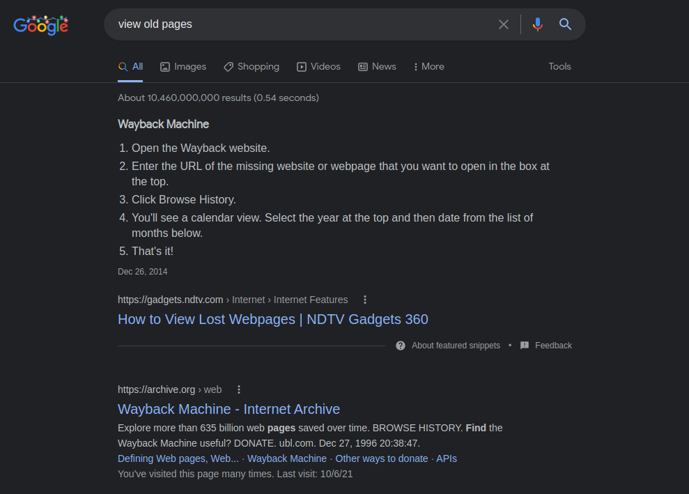
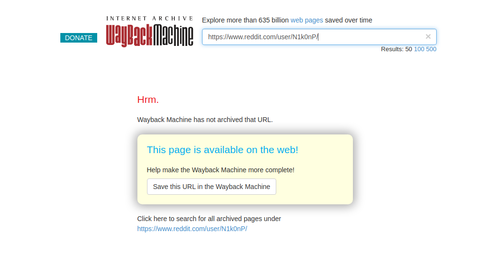
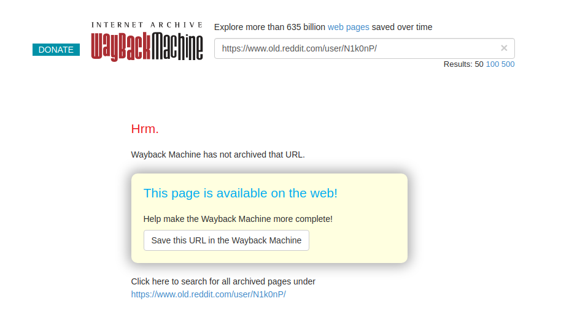
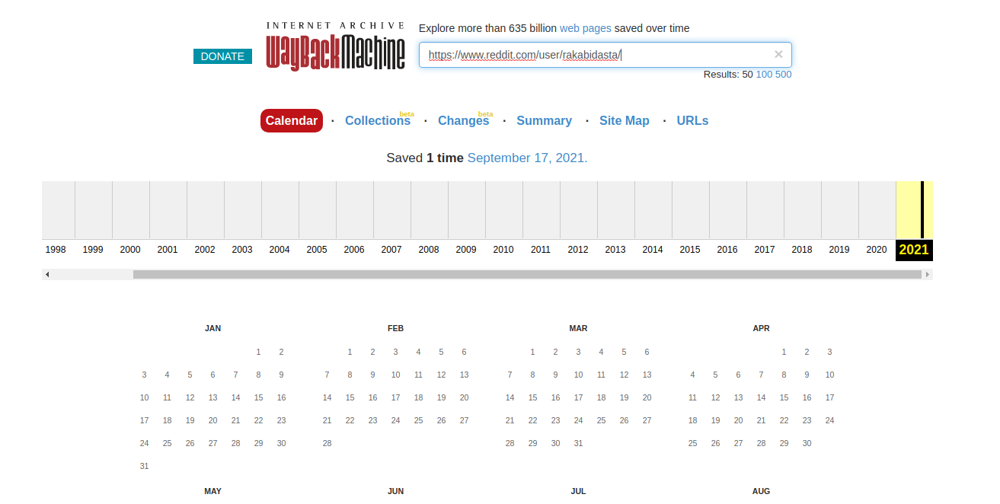
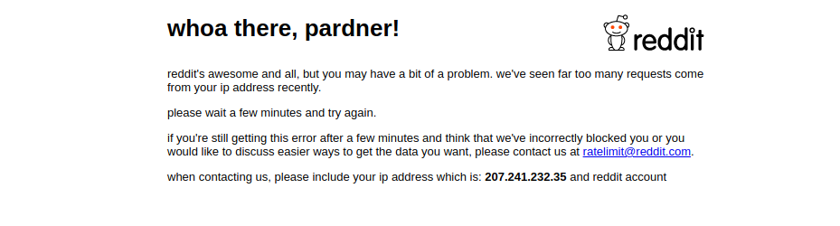
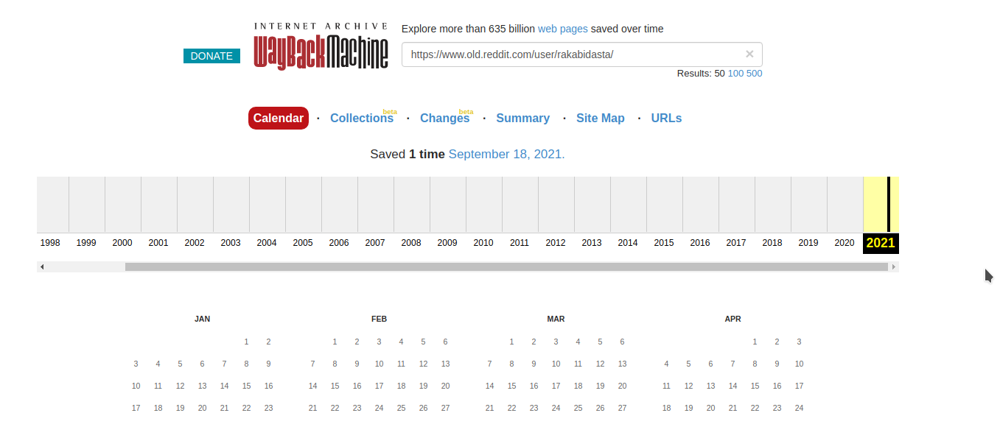
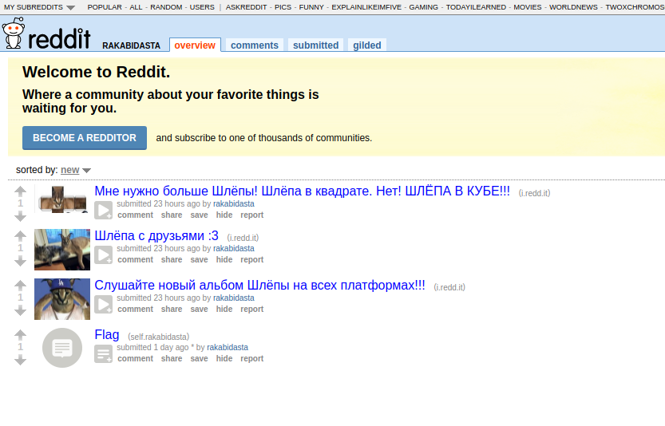
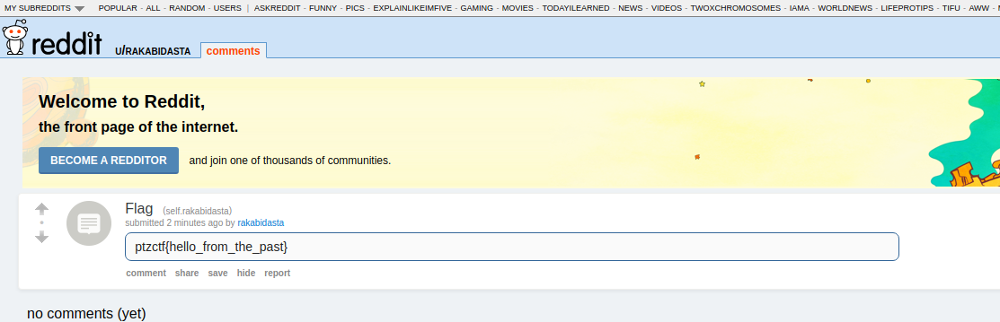

# Разбор таска Reddit

Категория:&nbsp;&nbsp;`OSINT`    
Стоимость:&nbsp;`500 - 100`  
First blood:&nbsp;&nbsp;`AppealSin`

---

## Что нам дано?

Давным-давно один из наших админов очень любил смотреть мемы про Шлёпу, но однажды про это узнали антиШлёперы и админу пришлось удалить все свои посты с реддита :(

---

## Как начать решать?

Первоначально нам надо определиться, где искать? Сказано, что-то про админов. Админы осеннего семестра - **NPC и Rakabidasta**. 

Также сказано, что мы должны найти **посты с реддита**. Более того нам дана информация, что это было **давным-давно**, но её **удалили**.

---

## Решение

### 1. Поиск старого реддита

Так как нам сказано, что это было давным-давно, то ищем старый реддит. Находим это: *https://old.reddit.com/*

### 2. Ищем админов на реддите

Поискав информацию какие же никнеймы у админов, находим: [NPC](https://www.reddit.com/user/N1k0nP/) и [Rakabidasta](https://www.reddit.com/user/rakabidasta/).

### 3. Как найти старые/ удалённые страницы

Забиваем в Google: `view old pages`. Находим [Wayback Machine](https://archive.org/web/)

### 4. Смотрим на старые страницы админов

Сначала поищем NPC:

Ничего не нашли :(

Продолжаем искать! Ищем в Wayback Machine его старую страницу

Не теряем веры в себя и ищем rakabidasta

О, что-то нашли, но там что-то стрёмное :(

Ищем старую страницу rakabidasta

И тут что-то есть! Посмотрим на это

Мы очень близко, тут есть страничка с флагом :)

---

## Результат

Флаг: `ptzctf{hello_from_the_past}`